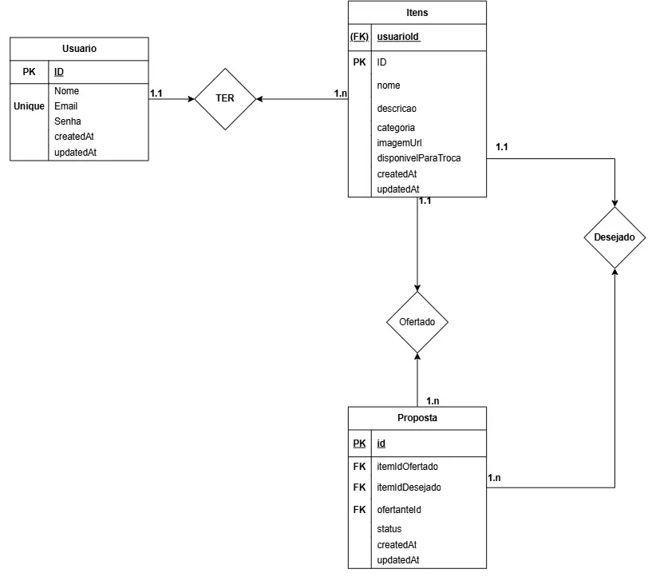

# 🏪 Feira de Trocas Comunitária - Fullstack

> **API REST para plataforma de trocas comunitárias** - Promovendo o consumo consciente e fortalecimento dos vínculos comunitários.

[](https://nodejs.org/)
[](https://expressjs.com/)
[](https://prisma.io/)
[](https://postgresql.org/)


## 📋 Sobre o Projeto

O **Feira de Trocas Comunitária - Fullstack** é uma plataforma completa (backend + frontend) que permite moradores de uma comunidade trocarem itens em bom estado que não usam mais, como livros, roupas, brinquedos e ferramentas. A aplicação conecta pessoas interessadas em oferecer e receber objetos, promovendo o consumo consciente.

### 🎯 Objetivo

Desenvolver uma aplicação web que permita:

- Cadastro de itens para troca
- Visualização de itens disponíveis com filtros
- Realização de propostas de troca entre usuários
- Sistema de aceite/rejeição de propostas

---

## 🚀 Tecnologias Utilizadas

### 🔧 Backend

- **[Node.js](https://nodejs.org/)** - Runtime JavaScript
- **[Express.js](https://expressjs.com/)** - Framework web
- **[Prisma ORM](https://prisma.io/)** - Object-Relational Mapping
- **[PostgreSQL](https://postgresql.org/)** - Banco de dados relacional
- **[JWT](https://jwt.io/)** - Autenticação segura
- **[bcryptjs](https://www.npmjs.com/package/bcryptjs)** - Criptografia de senhas

### 🎨 Frontend

- **[React](https://reactjs.org/)** - Biblioteca para interfaces
- **[Vite](https://vitejs.dev/)** - Build tool e dev server
- **[Tailwind CSS](https://tailwindcss.com/)** - Framework CSS utilitário
- **[React Router](https://reactrouter.com/)** - Roteamento SPA
- **[Axios](https://axios-http.com/)** - Cliente HTTP

---

## ⚡ Início Rápido

### 📋 Pré-requisitos

- **Node.js** (versão 16 ou superior)
- **PostgreSQL** (versão 12 ou superior)
- **npm** ou **yarn**
- **Git**

### 📥 Instalação

1. **Clone o repositório:**

   ```bash
   git clone git@github.com:MatheusQuintanilhaa/feira-trocas-backend.git
   cd feira-trocas-backend
   ```

2. **Instale as dependências do backend:**

   ```bash
   npm install
   ```

3. **Configure as variáveis de ambiente:**

   ```bash
   cp .env.example .env
   ```

4. **Configure o banco de dados:**

   ```bash
   npx prisma migrate dev
   npx prisma generate
   ```

5. **Inicie o servidor backend:**

   ```bash
   npm start
   ```

6. **Configure o frontend (em outro terminal):**

   ```bash
   cd frontend
   npm install
   npm run dev
   ```

🎉 **Aplicação completa rodando:**

- **Backend:** `http://localhost:8080`
- **Frontend:** `http://localhost:5173`

---

## 🆕 Principais Atualizações

- As propostas agora exibem nomes dos itens e usuários envolvidos, tornando a visualização mais clara e amigável.
- O backend foi corrigido para evitar erros internos ao criar propostas (campo inexistente removido).
- As regras de negócio de propostas estão documentadas e validadas: não é possível propor para si mesmo, só é possível propor com itens disponíveis, e apenas o dono do item ofertado pode iniciar uma proposta.
- O fluxo de troca pode ser testado facilmente pelo frontend ou via API (veja abaixo).

## 🔧 Funcionalidades

### 🏗️ Entidades do Sistema

| Entidade        | Descrição                                            |
| --------------- | ---------------------------------------------------- |
| **👤 Usuario**  | Representa quem utiliza a plataforma                 |
| **📦 Item**     | Representa os objetos disponibilizados para troca    |
| **🤝 Proposta** | Representa uma solicitação de troca entre dois itens |

### ⚙️ Principais Funcionalidades

- ✅ **Autenticação JWT** - Sistema seguro de login
- ✅ **CRUD Completo** - Criar, ler, atualizar e deletar itens
- ✅ **Filtros Avançados** - Por categoria, palavras-chave, disponibilidade
- ✅ **Sistema de Propostas** - Criação, aceite e rejeição de trocas
- ✅ **Controle Automático** - Gerenciamento de disponibilidade dos itens
- ✅ **Validações Robustas** - Garantia de integridade dos dados
- ✅ **Categorias Predefinidas** - Sistema organizado de classificação
- ✅ **Histórico de Atividades** - Acompanhamento de propostas

### 🔍 Categorias Disponíveis

- 📚 **Livros**
- 👕 **Roupas**
- 🧸 **Brinquedos**
- 📱 **Eletrônicos**
- 🔧 **Ferramentas**
- 🏠 **Casa e Jardim**
- ⚽ **Esportes**
- 🎵 **Música**
- 📂 **Outros**

---

## 🗄️ Modelo de Dados

### 📊 Diagrama Entidade-Relacionamento (DER)

O diagrama abaixo representa a estrutura do banco de dados e os relacionamentos entre as entidades:



### 🔗 Explicação dos Relacionamentos

#### **1. Usuario ↔ Item (1:N)**

- **Relacionamento**: Um usuário pode **TER** vários itens
- **Cardinalidade**: 1 para N (um-para-muitos)
- **Chave Estrangeira**: `usuarioId` na tabela `Item`

#### **2. Item ↔ Proposta (1:N) - Item Ofertado**

- **Relacionamento**: Um item pode ser **OFERTADO** em várias propostas
- **Cardinalidade**: 1 para N
- **Chave Estrangeira**: `itemOfertadoId` na tabela `Proposta`

#### **3. Item ↔ Proposta (1:N) - Item Desejado**

- **Relacionamento**: Um item pode ser **DESEJADO** em várias propostas
- **Cardinalidade**: 1 para N
- **Chave Estrangeira**: `itemDesejadoId` na tabela `Proposta`

---

## 📊 API Endpoints

Para informações detalhadas sobre todos os endpoints da API, consulte o **[Guia do Postman](POSTMAN_GUIDE.md)** que inclui:

- 🔐 **Autenticação**: Login e registro
- 👤 **Usuários**: CRUD completo
- 📦 **Itens**: Gerenciamento com filtros
- 🤝 **Propostas**: Sistema de trocas
- 🧪 **Exemplos**: Requests e responses

---

## 🧪 Testando a API

### 🎨 Testando o Fluxo de Propostas

1. Cadastre dois usuários e faça login com cada um.
2. Cada usuário deve cadastrar pelo menos um item disponível para troca.
3. Um usuário pode propor troca entre seu item e o item de outro usuário.
4. O sistema valida automaticamente as regras de negócio e exibe mensagens detalhadas em caso de erro.
5. As propostas aparecem com nomes dos itens e usuários envolvidos, status e data.

### 🎨 Interface Web (Frontend)

A aplicação possui uma interface web completa desenvolvida em React. Para usar:

1. **Acesse o frontend:** `http://localhost:5173`
2. **Registre-se** ou **faça login**
3. **Navegue pelas funcionalidades:**
   - 📋 **Home**: Visualizar todos os itens disponíveis
   - 📦 **Meus Itens**: Gerenciar seus próprios itens
   - ➕ **Criar Item**: Cadastrar novos itens para troca
   - ✏️ **Editar Item**: Modificar itens existentes
   - 🤝 **Propostas**: Visualizar e gerenciar propostas (agora com nomes dos itens e usuários)

### 🔧 Testando Regras de Negócio

- Não é possível propor troca para o próprio item.
- Só é possível propor troca se ambos os itens estiverem disponíveis.
- Apenas o dono do item ofertado pode iniciar uma proposta.
- O sistema exibe mensagens detalhadas em caso de erro.

#### 🔑 1. Primeiro, crie um usuário

```bash
POST http://localhost:8080/api/users/register
Content-Type: application/json

{
  "nome": "Maria Silva",
  "email": "maria@exemplo.com",
  "senha": "123456"
}
```

#### 🔐 2. Faça login para obter o token

```bash
POST http://localhost:8080/api/users/login
Content-Type: application/json

{
  "email": "maria@exemplo.com",
  "senha": "123456"
}
```

#### 📦 3. Criar um item (use o token no header)

```bash
POST http://localhost:8080/api/items
Authorization: Bearer SEU_TOKEN_AQUI
Content-Type: application/json

{
  "nome": "Livro de JavaScript",
  "descricao": "Livro em ótimo estado sobre programação",
  "categoria": "Livros"
}
```

---

## 📊 Scripts Disponíveis

### 🔧 Scripts do Backend

| Script              | Comando                  | Descrição                   |
| ------------------- | ------------------------ | --------------------------- |
| **Desenvolvimento** | `npm start`              | Inicia servidor com nodemon |
| **Prisma Studio**   | `npx prisma studio`      | Interface visual do banco   |
| **Migrações**       | `npx prisma migrate dev` | Executa migrações pendentes |
| **Gerar Cliente**   | `npx prisma generate`    | Gera o cliente Prisma       |

### 🎨 Scripts do Frontend

| Script              | Comando           | Descrição                   |
| ------------------- | ----------------- | --------------------------- |
| **Desenvolvimento** | `npm run dev`     | Inicia servidor Vite        |
| **Build Produção**  | `npm run build`   | Gera build otimizado        |
| **Preview**         | `npm run preview` | Visualiza build de produção |
| **Lint**            | `npm run lint`    | Executa ESLint              |

---

## 📁 Estrutura do Projeto

```
feira-trocas-backend/
├── 📁 src/                  # 🔧 Backend
│   ├── 📁 controllers/      # 🧠 Lógica de negócio
│   ├── 📁 middlewares/      # 🔒 Autenticação e autorização
│   ├── 📁 routes/           # 🛣️ Definição das rotas
│   └── 📄 app.js           # ⚙️ Configuração do Express
├── 📁 frontend/             # 🎨 Frontend React
│   ├── �� src/
│   │   ├── 📁 components/   # 🧩 Componentes reutilizáveis
│   │   ├── 📁 pages/        # 📄 Páginas da aplicação
│   │   ├── 📁 contexts/     # 🔄 Context API (autenticação)
│   │   ├── 📁 services/     # 🌐 Comunicação com API
│   │   └── �� App.jsx      # 🏠 Componente principal
│   ├── �� index.html       # 🌐 Template HTML
│   ├── 📄 vite.config.js   # ⚙️ Configuração do Vite
│   └── 📄 tailwind.config.js # 🎨 Configuração do Tailwind
├── 📁 prisma/
│   ├── 📄 schema.prisma    # 🏗️ Schema do banco de dados
│   └── 📁 migrations/      # 🔄 Arquivos de migração
├── 📁 generated/           # 🤖 Cliente Prisma gerado
├── 📄 package.json         # 📦 Dependências do backend
├── 📄 .env.example         # 🔧 Exemplo de configuração
└── 📄 README.md           # 📖 Documentação
```

---

## 🎓 Sobre o Projeto

### 📚 Contexto Acadêmico

Este projeto foi desenvolvido como parte do **bootcamp da Atlântico Avanti**.

### 🎯 Problema Resolvido

Em muitas comunidades, moradores acumulam itens em bom estado que não usam mais. Esses objetos poderiam ser reaproveitados se trocados entre os próprios vizinhos. Esta API resolve esse problema criando uma plataforma que conecta pessoas interessadas em trocar objetos.

### 👨‍💻 Desenvolvedor

- **Desenvolvedor**: Matheus Quintanilha
- **GitHub**: [@MatheusQuintanilhaa](https://github.com/MatheusQuintanilhaa)
- **Bootcamp**: Atlântico Avanti

---

## 🛡️ Status do Projeto

- ✅ **Backend Completo** - API REST funcional
- ✅ **Frontend Completo** - Interface React responsiva
- ✅ **Autenticação JWT** - Sistema seguro de login
- ✅ **CRUD Completo** - Criar, listar, editar e deletar itens
- ✅ **Sistema de Propostas** - Criar e gerenciar trocas
- ✅ **Filtros e Busca** - Filtrar por categoria e texto
- ✅ **Documentação** - README detalhado
- ✅ **Estrutura Profissional** - Código organizado

---
